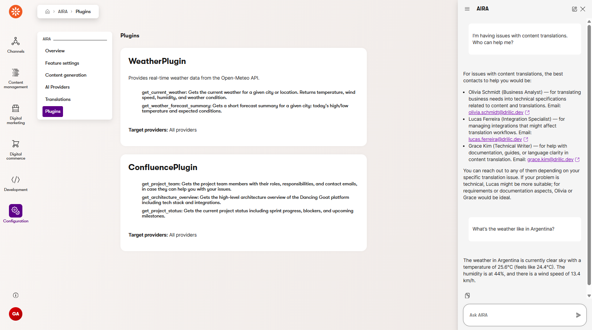

# xperience-aira-plugins

The xperience-aira-plugins project is a plugin framework for extending Kentico's Aira AI assistant with custom Semantic Kernel plugins. It enables registration and injection of custom AI functions into the Aira chat completion pipeline without replacing Kentico's underlying LLM provider.



> This library is designed as an extensibility layer on top of Kentico's built-in Aira integration. It uses the decorator pattern to wrap the existing `IChatCompletionService` and inject registered plugins into the Semantic Kernel before each chat call. Plugins are auto-discovered via marker interfaces and registered through dependency injection.

## Requirements

- **Kentico.Xperience.Admin 31.1.2** or newer to use the latest Xperience by Kentico
- **net10.0** (long-term support release)
- **Microsoft.SemanticKernel** packages for plugin development

## Download & Installation

1. Download the source code
2. Include the downloaded library in your project
    * Copy the _EXLRT.Xperience.AIRA.Plugins_ folder into your project
    * Add it as an existing project in Visual Studio/VS Code
    * Add a project reference to your main project
    * Rebuild the solution

## Setup

### Create a Plugin

Create a class that implements `IAiraPlugin` and decorate methods with `[KernelFunction]` and `[Description]` attributes:

```csharp
using EXLRT.Xperience.AIRA.Plugins.Abstractions;
using Microsoft.SemanticKernel;
using System.ComponentModel;

[Description("Provides real-time weather data from the Open-Meteo API.")]
public class WeatherPlugin : IAiraPlugin
{
    // Unique name of the plugin, used for identification in Aira and the admin UI
    public string PluginName => "Weather";

    [KernelFunction("get_weather")]
    [Description("Gets the current weather for a given city")]
    public string GetWeather(string city)
    {
        // Add custom logic here — call an API, etc.
        return $"The weather in {city} is sunny.";
    }
}
```

### Register Plugins

Method definitions:
```csharp
// Register individual plugin (with optional per-plugin enhancement)
IServiceCollection AddAiraPlugin<TPlugin>(this IServiceCollection services, Action<AiraPluginOptions>? configure = null)
    where TPlugin : class, IAiraPlugin;

// Initialize plugin support and wrap chat completion service
IServiceCollection UseAiraPlugins(this IServiceCollection services);
```

Example of configuration (Program.cs):

```csharp
using EXLRT.Xperience.AIRA.Plugins;

// Initialize plugin support
builder.Services.UseAiraPlugins();

// Register plugins (before UseAiraPlugins)
builder.Services.AddAiraPlugin<WeatherPlugin>(options =>
{
    options.EnhancementPrompt = "Summarize weather naturally.";
});
builder.Services.AddAiraPlugin<ConfluencePlugin>(); // no enhancement
```

### Per-Plugin Response Enhancement (Optional)

Each plugin can have its own enhancement prompt configured at registration time. When set, the prompt is prepended to the plugin's function result via a Semantic Kernel `IFunctionInvocationFilter`, allowing the LLM to naturally incorporate the instruction when processing the tool result.

```csharp
builder.Services.AddAiraPlugin<WeatherPlugin>(options =>
{
    options.EnhancementPrompt = "Summarize weather data naturally in a conversational tone.";
});
```

- If `EnhancementPrompt` is set, enhancement is active for that plugin.
- If `EnhancementPrompt` is null or empty, the plugin's results are returned unchanged.
- Enhancement works with streaming since it modifies the tool result, not the final response.

> **Note:** The `IFunctionInvocationFilter`-based enhancement works when using Kentico's built-in Aira service (which uses the SK kernel natively). Custom providers using `Microsoft.Extensions.AI`'s `UseFunctionInvocation()` may not invoke SK's `kernel.FunctionInvocationFilters`.

### Custom Chat Completion Services

Allows you to override the Aira chat interface with custom LLM providers while still leveraging the plugin framework. Create a class that inherits from `ChatCompletionServiceExtensionsBase` and override the necessary methods to call your provider's API.

```csharp
public sealed class AnthropicChatCompletionService : ChatCompletionServiceExtensionsBase
{
    public AnthropicChatCompletionService(
        [FromKeyedServices(AiraPluginServiceKeys.OriginalChat)] IChatCompletionService kenticoService,
        IEnumerable<IAiraPlugin> plugins,
        IAiraPluginRegistry registry,
        IConfiguration configuration)
        : base(kenticoService, plugins, registry)
    {         
        // Initialize your provider client here using configuration
    }
}
```

You can find details in the [examples](examples/) folder.


### Plugin-to-Provider Restrictions (Optional)

This requires the _xperience-aira-providers_ library (https://github.com/drilic/xperience-aira-providers).

When using the _EXLRT.Xperience.AIRA.Providers_ library with multiple custom providers, you can restrict which plugins are available to which provider. This is useful when certain plugins should only be accessible to a specific LLM provider (e.g., a plugin that relies on Claude-specific capabilities should not be available to an OpenAI-based chat service).

The restriction mechanism requires **two parts** working together:

#### 1. The chat service identifies its provider

Your `ChatCompletionServiceExtensionsBase` subclass must override `AssociatedProviderType` to declare which provider it belongs to. The type is the `IAiraClient` implementation type — it acts as the provider's identity:

```csharp
public sealed class AnthropicChatCompletionService : ChatCompletionServiceExtensionsBase
{
    // Links this chat service to the Anthropic provider
    protected override Type? AssociatedProviderType => typeof(CustomAnthropicAiraClient);

    // ... rest of implementation
}
```

If `AssociatedProviderType` is not overridden (defaults to `null`), any plugin that specifies `TargetProviders` will be **excluded** from this chat service — because there is no provider type to match against.

#### 2. The plugin declares its target providers

Implement the `TargetProviders` property on your plugin to restrict which providers can use it:

```csharp
[Description("Provides real-time weather data.")]
public class WeatherPlugin : IAiraPlugin
{
    // Only available to the Anthropic provider's chat service
    public IReadOnlyList<Type>? TargetProviders => [typeof(CustomAnthropicAiraClient)];

    // ... kernel functions
}
```

#### How the filtering works

The base class evaluates each plugin before every chat call using the following logic:

| `TargetProviders` value | `AssociatedProviderType` value | Result |
|---|---|---|
| `null` or empty | Any | Plugin is **registered** (available to all) |
| `[typeof(ProviderA)]` | `typeof(ProviderA)` | Plugin is **registered** (match) |
| `[typeof(ProviderA)]` | `typeof(ProviderB)` | Plugin is **excluded** (no match) |
| `[typeof(ProviderA)]` | `null` (not overridden) | Plugin is **excluded** (no provider identity to match) |

A plugin can target multiple providers:

```csharp
public IReadOnlyList<Type>? TargetProviders => [typeof(CustomAnthropicAiraClient), typeof(CustomOpenAIAiraClient)];
```

> **Note:** Plugin restrictions only apply to the **chat completion pipeline** (`IChatCompletionService`). `IAiraClient` implementations (used for email generation, translation, image analysis, etc.) do not have access to plugins or the Semantic Kernel — they operate as standalone request/response services.

### Admin UI

Once plugins are registered, an **Aira Plugins** page is automatically available in the Xperience admin under the Aira application. The page displays:

- A card for each registered plugin showing its name, description, available functions, target provider restrictions, and enhancement status
- A "No Plugins Registered" message if no plugins exist

## Disclaimer

This project is a **showcase and proof of concept** demonstrating how Kentico's Aira AI assistant can be extended with custom plugins. It illustrates the possibilities of the Aira plugin architecture — injecting custom Semantic Kernel functions, configuring per-plugin behavior, and integrating third-party AI providers alongside Kentico's built-in service.

This is **not an official Kentico product** and is not intended for production use without further review and hardening. Use it as a reference, learning resource, and starting point for building your own Aira customizations.

## Contributions and Support

Feel free to fork and submit pull requests or report issues. We will look into them as soon as possible.
